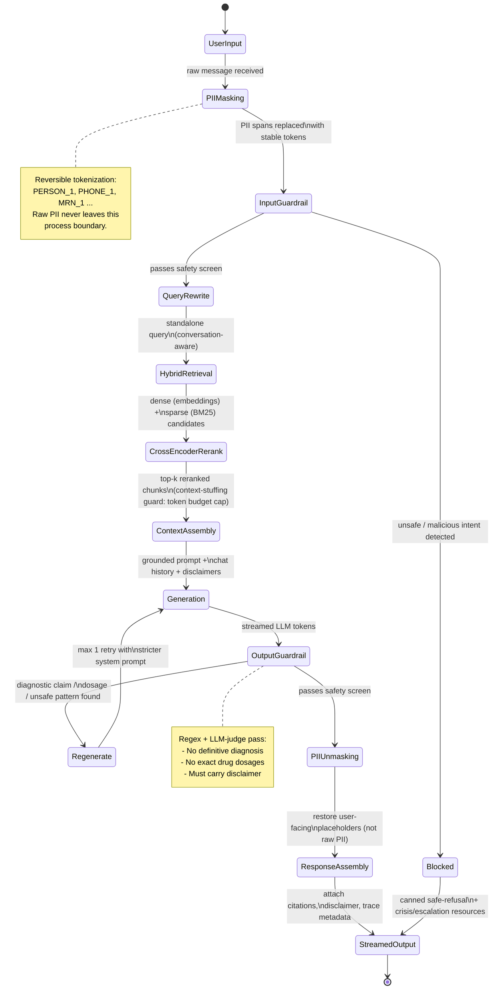
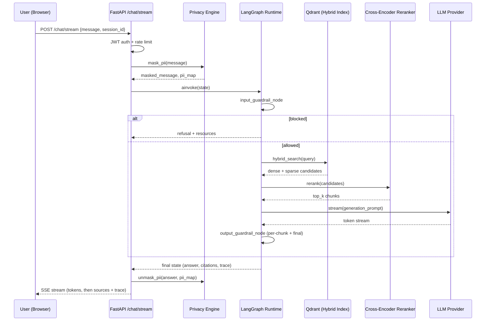

# Pathos AI — System Architecture

## 1. LangGraph Clinical Routing State Machine

Every inbound message is compiled into a `PathosGraphState` object and passed through
a directed graph of nodes. Each node is a pure function `(state) -> state` (or an async
node for I/O-bound work), which makes the pipeline replayable, testable in isolation,
and fully traceable in LangSmith / Arize Phoenix.



## 2. Why a graph, not a chain

A linear chain assumes the happy path always applies. Clinical dialogue does not:
a message can be unsafe before retrieval ever runs, a generation can fail guardrails
and need exactly one bounded retry, and a blocked message must short-circuit straight
to output without ever touching the vector store or the LLM. LangGraph models these as
explicit edges and conditional branches instead of `if/else` sprawl inside a single
function, which is what makes the state machine above directly executable as code
(see `app/engines/llm_graph.py`) instead of just documentation.

## 3. Request lifecycle (sequence view)



## 4. Component responsibilities

| Layer | Module | Responsibility |
|---|---|---|
| API | `app/main.py`, `app/routers/*` | HTTP/SSE surface, auth, request validation |
| Service | `app/services/privacy_engine.py` | PII detection, tokenization, reversible masking |
| Service | `app/services/guardrails.py` | Input/output clinical safety checks |
| Service | `app/services/retrieval_service.py` | Hybrid search orchestration against Qdrant |
| Engine | `app/engines/llm_graph.py` | LangGraph state machine (the diagram above, as code) |
| Engine | `app/engines/embeddings.py` | Dense embedding + BM25 sparse encoding |
| Engine | `app/engines/reranker.py` | Cross-encoder reranking (FlashRank) |
| Data | `app/models/db_models.py`, `app/database.py` | SQLAlchemy ORM, session/user/message persistence |
| Core | `app/core/telemetry.py` | OpenTelemetry + LangSmith tracing hooks |
| Core | `app/core/logging_config.py` | Structured, PII-safe JSON logging |

## 5. Data privacy boundary

```mermaid
flowchart LR
    subgraph Trust Boundary: Pathos AI Backend
        A[Raw user message] --> B[Privacy Engine\nPII Masking]
        B --> C[Masked message\nPERSON_1, MRN_1, PHONE_1]
    end
    C --> D[LLM Provider\n(OpenAI / Anthropic API)]
    C --> E[Structured Logs / LangSmith Trace]
    B -.->|pii_map kept in-memory\nper-request only| F[(Never persisted\nto DB or logs)]
```

Raw PII is only ever held in-process, in memory, for the lifetime of a single request
(the `pii_map` dict). It is not written to the database, not written to logs, and not
sent to any external LLM provider — only the masked, tokenized surrogate text crosses
that boundary. Unmasking happens after generation, purely for rendering the response
back to the authenticated user who owns the session.
